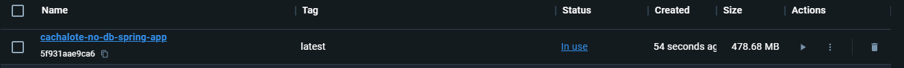
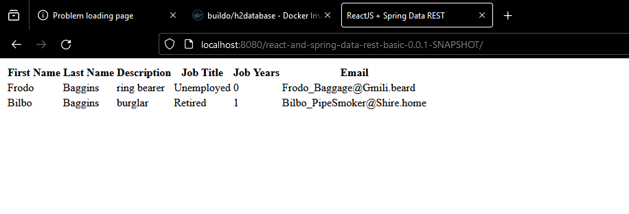
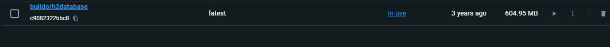
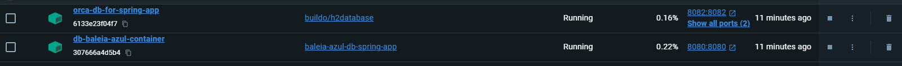
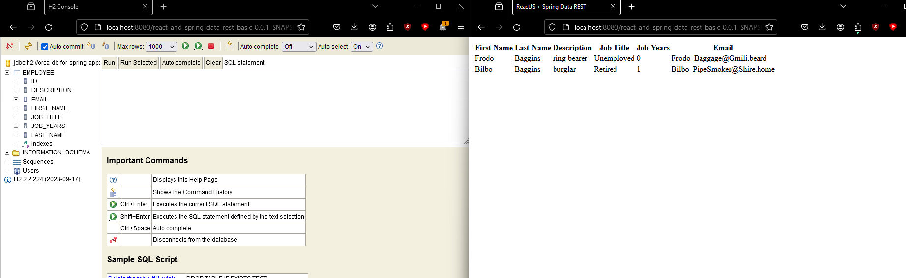
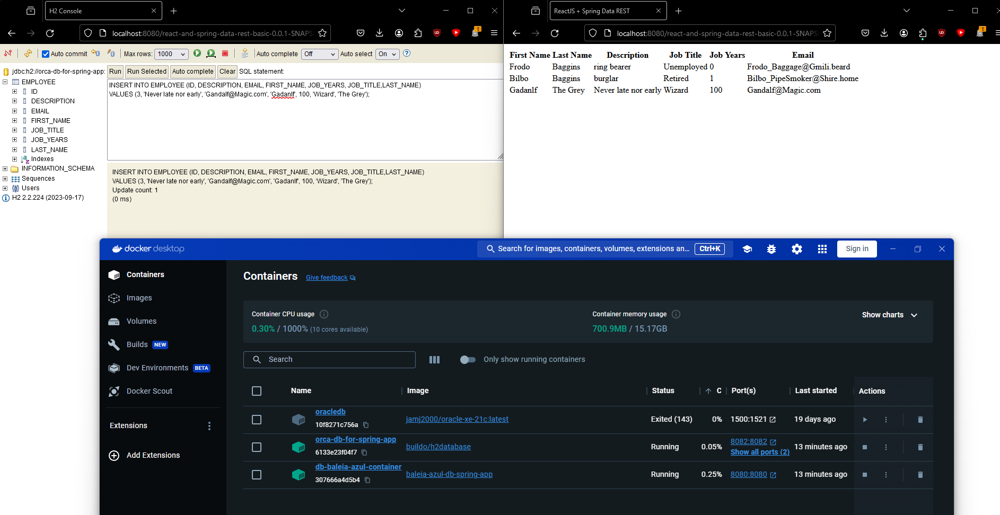

# Report for Class assignment 3 - Part 2 - Luís Silva 1231869

## Report Structure
- [Description of assigment](#description-of-assignment)
- [Virtualization automation - Vagrant with Virtual Box](#virtualization-automation---vagrant-with-virtual-box)
  - [Task preparation - Vagrant VB](#task-preparation---vagrant-vb)
    - [Task 1](#task-1)
    - [Task 2](#task-2)
    - [Task 3](#task-3)
- [Alternative - Other virtualization providers - Qemu](#alternative---other-virtualization-providers---qemu)
- [Task preparation - Vagrant Qemu](#task-preparation---vagrant-qemu)
- [Alternative - Containerization with Docker](#alternative---containerization-with-docker)
  - [Task preparation - Docker](#task-preparation---docker) 
    - [Task 4](#task-4)
    - [Task 5](#task-5)
- [Conclusion](#conclusions)

## Description of assignment
In this assigment we explore Virtualization automation tools like Vagrant and see how they can help us with creating standardized specific, virtual machine environments, capable of running our applications.  
We also explore an alternative to virtualization automation which is containerization using Docker, to deploy standard predictable containers, so we can even more easily and quickly deploy our applications.
## Virtualization automation - Vagrant with Virtual Box

### Task preparation - Vagrant VB

#### Task 1

#### Task 2

#### Task 3

## Alternative - Other virtualization providers - Qemu

### Task preparation - Vagrant Qemu

## Alternative - Containerization with Docker

### Task preparation - Docker

#### Task 4

#### Task 5

## Conclusion


Part 1 - Following tutorial

Get Repo and install Vagrant;
Create folder called VagrantVA and put the Vagrantfile inside;
Open a terminal in the VagrantVA folder and run the command `vagrant up`;
Vagrant creates 2 VMS  that we can see in virtual box;
We can ssh into these machines by opening a terminal in the VagrantVA folder and running the command `vagrant ssh <machine name>`;
We can use the browser to access it using the IP and ports inside the vagrant file;
Using http://192.168.56.11:8082 we have access to the H2 console and using http://192.168.56.10:8080/ we get the It works! landing page of Apache Tomcat  
------------------------------------------------------------------------------------------------------------------------


Part 2 - Setup CA3Part2 Issue #20

Make our repo public so Vagrant can clone it;
Copy Vagrant file into folder;

Use the manually done requirements in CA3/Part1:
- For both VMs change java version to 17;
- Starting with the Web VM:
  - Add set -e command to the top of the script to avoid continuing if an error occurs;
  - Install Git;
  - Install Gradle 8.6 which is what we manually did in CA3/Part1 so our application could run;

  - Remove war file deployment as we are not using it;
  - Add section to clone our repo;
  - Add section to navigate into our cloned repo and then into CA2/Part2;
  - Change gradlew permissions like what we had to do in CA3/Part1;
  - Add command to build our application;
  - Add command to run our application (has this funky command that pipes the possible errors into a file);

- Run vagrant up and check if the vms boot up fine - We open a terminal where our Vagrant file is and run the command `vagrant up` and check if the VMs boot up fine.
We see the Gradle notification saying build successful and the application is running;
- SSH into the web vm and check if content is present (it is) using the command `vagrant ssh web` and then `ls` to see the contents of the folder. We see:;
vagrant@web:~$ ls
devops-23-24-PSM-1231869  gradle-8.6-bin.zip  spring-boot-app.log
We can then exit our ssh session using the command `exit`;
- Check if app is running by going into the VM's ip specified in the VagrantFile 192.168.56.10 and port 8080 since it's where Tomcat is running in.
We see the same table we had in CA3/Part1 which is the same as in CA2/Part2 (with the new line and column that were added in CA1);
- We stop our VMs using the command `vagrant halt` and commit our changes to our repo to issue #20;
------------------------------------------------------------------------------------------------------------------------


Part 3 - Set up H2 Database and try to connect Issue #21

CA2/Part2 has the H2 database dependency in the build.gradle file;
We connect to the IP of the db VM and port 8082 to access the H2 console using our browser. There we can log into our database create/run our queries;
We boot up our VMs using the command `vagrant up` and ssh into the db vm using the command `vagrant ssh db` and we see a jar inside obtained after vagrant executes the wget command specified in the DB VM section;
This however doesn't mean that our Spring application is communicating with the H2 database (Web VM is not communicating with the DB VM);
We must set this up by adding/altering the application.properties file in the resources folder of our Spring application (CA2/Part2):
- We add the following lines to the application.properties file based on the application.properties in this repo (https://bitbucket.org/pssmatos/tut-basic-gradle/src/master/):
  ```properties
  server.servlet.context-path=/react-and-spring-data-rest-basic-0.0.1-SNAPSHOT
  spring.data.rest.base-path=/api
  
  spring.datasource.url=jdbc:h2:tcp://192.168.56.11:9092/./jpadb;DB_CLOSE_DELAY=-1;DB_CLOSE_ON_EXIT=FALSE
  spring.datasource.driverClassName=org.h2.Driver
  spring.datasource.username=sa
  spring.datasource.password=
  spring.jpa.database-platform=org.hibernate.dialect.H2Dialect
  
  spring.jpa.hibernate.ddl-auto=update
  spring.h2.console.enabled=true
  spring.h2.console.path=/h2-console
  spring.h2.console.settings.web-allow-others=true
  ```
  On the end of spring.datasource.url, this is added to avoid automatic closure of our database when the last connection is closed;
- Since our CA2 Repo has changed we must clone it again and build it again, so we use vagrant to destroy the current VMs and then start them up with the correct data;
- We destroy our VMs using the command `vagrant destroy` and then commit our done for CA2/Part2 to issue #21 so vagrant has access to the changes in applications.properties;
- First we can ssh into our web VM and ping our db VM to check if they are communicating using the command `ping 192.168.56.11`;
- Then we can try to access the H2 console using the IP of the db VM and port 9092 in our browser;
  - At the login screen we can use the credentials we specified in the application.properties file (sa and BLANK and the link to see the H2 database: jdbc:h2:tcp://192.168.56.11:9092/./jpadb;DB_CLOSE_DELAY=-1;DB_CLOSE_ON_EXIT=FALSE);
  - We see the same data that was rendered in the web VM when we accessed the application in the browser after doing the query SELECT * FROM EMPLOYEE;
  - 
- If we try to connect to our web VM using the browser we see it doesn't render and by using `vagrant ssh web` and reading the log we see there's an exception encountered with spring after connecting the DB;

GOOD ISH UNTIL HERE commit  7169c98 - BASICALLY IT BUILDS CORRECTLY BUT BOOTRUN FAILS SEE SPRING LOG IN VM.
#Install required items like specified in CA3/Part1
#Gradle was removed because it was redudant, Gradlewrapper worked fine

- Upon investigation we see there's an issue between jakarta and Hibernate (https://www.baeldung.com/hibernate-no-persistence-provider);
- We specify the Hibernate version to be used (6.4.2.Final) in our build.gradle file - did not fix;
- turns out the issue is with hibernate and h2 https://groups.google.com/g/h2-database/c/vq3Q7X3muJQ;
- We found this blog (https://velog.io/@soluinoon/H2-Column-startvalue-not-found-%EC%98%A4%EB%A5%98) swapped the application.properties line:
  spring.jpa.hibernate.hbm2ddl-auto=update;
- Still nothing. 

AFTER A LOT OF TRIAL AND ERROR:
Tried in side project normally with basic version of application built in CA1/CA2. Built it from scratch:
https://github.com/sepsilva/testDevops


MADE ENTRY IN REPO STABLE (COMMIT 61340e5) AT THIS MOMENT SPRING APPLICATION IS STABLE AND WILL LAUNCH ON WEB VM CORRECTLY
Going to work from here.

OK COMPARED TO TESTDEVOPS. GOING TO TRY DEPLOYMENT FINAL TIME TO SEE IF IT WORKS WITH CA2/PART2. VM WEB AND DB INTEGRATION. CHANGED
build.gradle commented task;
apps.js get path;
application.properties to include h2 and servlet path;
Uncomented tomcat10 insatlation and war copy to tomcat10/webapps in vagrantFile.

Everthing is working now except the proper render but idc...
Using the H2 Console we can:
INSERT INTO EMPLOYEE (ID, DESCRIPTION, EMAIL, FIRST_NAME, JOB_YEARS, JOB_TITLE,LAST_NAME)
VALUES (3, 'Never late nor early', 'Gandalf@Magic.com', 'Gadanlf', 100, 'Wizard', 'The Grey');

And our table expands.
First Name	Last Name	Description	Job Title	Job Years	Email
Frodo	Baggins	ring bearer	Unemployed	0	Frodo_Baggage@Gmili.beard
Bilbo	Baggins	burglar	Retired	1	Bilbo_PipeSmoker@Shire.home
-> Gadanlf	The Grey	Never late nor early	Wizard	100	Gandalf@Magic.com


Big issue seemed to be the connection between servlet class, appjs and the servlet in application.properties. A missing / and a 404 will be found easily

------------------------------------------------------------------------------------------------------------------------

Part 4 - Alternative - Docker Container vs Virtualization

Docker works with containers. The concept feels similar to VM's but these all run in our system and we overall it seems more flexible.

https://hub.docker.com/r/buildo/h2database/#!
docker pull buildo/h2database
To pull a container running h2

we can run h2 with: docker run -d --name h2-database -p 8082:8082 -p 9092:9092 buildo/h2database

then if we go into localhost:8082 we see the h2 log in screen since now the database runs on our host machine (much faster)

now for our spring application:
First, to get an easy start we comment the h2 database connection on our application properties. This is so we can first test our machine running
without needing 2 containers communicating. We can simply comment out the properties for this connection.

```properties
server.servlet.context-path=/react-and-spring-data-rest-basic-0.0.1-SNAPSHOT
spring.data.rest.base-path=/api
#To enable the H2 database so our Web VM in CA3/Part2 can communicate with the database in the DB VM in CA3/Part1

#The command at the end prevents the database from closing when the last connection is closed
#spring.datasource.url=jdbc:h2:tcp://192.168.56.11:9092/./jpadb;DB_CLOSE_DELAY=-1;DB_CLOSE_ON_EXIT=FALSE
#spring.datasource.driverClassName=org.h2.Driver
#spring.datasource.username=sa
#spring.datasource.password=
#spring.jpa.database-platform=org.hibernate.dialect.H2Dialect

#spring.jpa.hibernate.ddl-auto=update
#spring.h2.console.enabled=true
#spring.h2.console.path=/h2-console
#spring.h2.console.settings.web-allow-others=true
```

We create a new docker file based on our spring application. This dockerfile only provides a tomcat10 server

We'll have to build our application first by going to its root and running ./gradlew build so we can have our web archive file that is deployed to tomcat
``` dockerfile
  #Create a basic container with java 17 and running tomcat 10 similar to what our vagrant file does
  FROM tomcat:10-jdk17-openjdk-slim
  
  LABEL authors="Luis"
  
  #Similar to what we did in the vagrant file we must deploy the generated war file that we obtain after ./gradlew build and place it inside our tomcat webapps
  COPY ./build/libs/react-and-spring-data-rest-basic-0.0.1-SNAPSHOT.war ./webapps
  
  #State the port that our application will run on
  EXPOSE 8080
  
  #start tomcat automatically when container starts
  CMD ["catalina.sh", "run"]
```

We can then create a new docker image based on this dockerFile by (at its root) executing it using: docker build -t luis-spring-app-in-docker .    

We can then run this image as a container with a cetacean themed name using: docker run --name whale-spring-app -d -p 8080:8080 luis-spring-app-in-docker

Since the container is running on our machine we can go to localhost:8080/react-and-spring-data-rest-basic-0.0.1-SNAPSHOT and we see our table of content similar to what we did before!


---------
Moved it to CA3/Part2 to have better fine grain control and not affect other CA.
Built application with no db connection in CA2/Part2. Moved generated war file to alternative CA3/Part2 folder.
Created docker file:
``` dockerfile
  #Create a basic container with java 17 and running tomcat 10 similar to what our vagrant file does
  FROM tomcat:10-jdk17-openjdk-slim
  
  LABEL authors="Luis"
  
  #Similar to what we did in the vagrant file we must deploy the generated war file that we obtain after ./gradlew build and place it inside our tomcat webapps
  COPY ./react-and-spring-data-rest-basic-0.0.1-SNAPSHOT.war ./webapps
  
  #State the port that our application will run on
  EXPOSE 8080
  
  #start tomcat automatically when container starts
  CMD ["catalina.sh", "run"]
```
Created docker image with success: docker build -t cachalote-no-db-spring-app .


Ran container with success: docker run --name no-db-cachalote-container -d -p 8080:8080 cachalote-no-db-spring-app  


Able to access through browser with success


4.1 Connecting 2 docker containers to have db in our spring application
As said before we're using this pre prepared image: https://hub.docker.com/r/buildo/h2database/#
We import this image using: docker pull buildo/h2database

We create a container named orca-db-for-spring-app using: docker run -d --name orca-db-for-spring-app -p 8082:8082 -p 9092:9092 buildo/h2database


We need this docker container name because if we follow the documentaion in the hub page we see that the jdbc link provided by the 
container image has its name and we need to feed it into the application.properties before building our app so we can have a proper war file. Also the username and pass is null
spring.datasource.url=jdbc:h2://orca-db-for-spring-app:9092/./jpadb;DB_CLOSE_DELAY=-1;DB_CLOSE_ON_EXIT=FALSE

```properties
server.servlet.context-path=/react-and-spring-data-rest-basic-0.0.1-SNAPSHOT
spring.data.rest.base-path=/api
#To enable the H2 database so our Web VM in CA3/Part2 can communicate with the database in the DB VM in CA3/Part1

#The command at the end prevents the database from closing when the last connection is closed
spring.datasource.url=jdbc:h2://orca-db-for-spring-app:9092/./jpadb;DB_CLOSE_DELAY=-1;DB_CLOSE_ON_EXIT=FALSE
spring.datasource.driverClassName=org.h2.Driver
spring.datasource.username=
spring.datasource.password=
spring.jpa.database-platform=org.hibernate.dialect.H2Dialect

spring.jpa.hibernate.ddl-auto=update
spring.h2.console.enabled=true
spring.h2.console.path=/h2-console
spring.h2.console.settings.web-allow-others=true
```
We edit the link and build the application and copy the war 
file into our DockerAlternativeDBConnection folder and create a docker image based on it using: docker build -t baleia-azul-db-spring-app .

We can then run the container using: docker run --name db-baleia-azul-container -d -p 8080:8080 baleia-azul-db-spring-app  



!! it worked!!

We again try an insert through the console et voila!!
INSERT INTO EMPLOYEE (ID, DESCRIPTION, EMAIL, FIRST_NAME, JOB_YEARS, JOB_TITLE,LAST_NAME)
VALUES (3, 'Never late nor early', 'Gandalf@Magic.com', 'Gadanlf', 100, 'Wizard', 'The Grey');



-----------------------------------------------------
Other virtualization because docker....anyway... here's qemu. 
The we install qemu(https://www.qemu.org/download/#windows) using the given binary. We added it to our windows environment variable path.
then we must install vagrant plugin install vagrant-libvirt so we can use qemu as the virtualization provider.
The plug in won't install so vagrant won't recognize it as our provider and will
We must edit our vagrant file so we specify the provider to be qemu. Qemu also requires different setup and we must also use different ubuntu version.
Qemu is basically faster and open sourcerererer than Virtual Box. However it's super obtuse to get into.

So DOCKER!


So we can't get it to work. And I have an alternative.
Docker in the context of this CA is an alternative to Vagrant.
Vagrant is automation of virtualization which allows us to create a file that deploys a virtual machine using a given hypervisor (e.g. Virtual Box) with certain specification, like an ip, an app running on a server etc..
Containers are basically the same concept!!!! It's a standard environment that can be quickly deployed and can be deployed from a file that sets up the same thing every time.
The equivalent to a VagrantFile is a DockerImage. When we execute a vagrant file using vagrant up it's like running a container.

OK I get it... Vagrant is a way to manage development environments through virtualization. To an extent it's the same thing Kubernets does with Docker containers. It's an orchestrator.